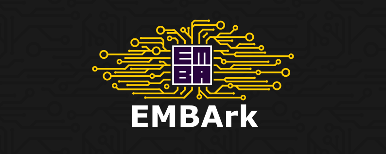

# EMBArk - The firmware security scanning environment  

  

  
  
  
  
  
  

# About

*EMBArk* is a tool for centralized firmware analyzing.
Scan, Identify, Track, Report.
Built to be simple but powerful.
It's the web-based enterprise interface for the firmware security scanner *EMBA*. It is developed to provide the firmware security analyzer *[EMBA](https://github.com/e-m-b-a/emba)* as a service with feature-packed UI and to improve accessibility to the firmware scanning backend *EMBA* regardless of the system and operating system.
Furthermore, *EMBArk* improves the data provision by aggregating the various scanning results in an [aggregated management dashboard](https://github.com/e-m-b-a/embark/wiki/Web-interface#main-dashboard).

# Important

* The new Tracking application currently doesn't work offline.
* The device, Vendor and version tracking aren't fully integrated into all dashboards yet.
* the only supported OS at this time is Ubuntu LTS (24)

## Quick-Start
`git clone https://github.com/e-m-b-a/embark.git; cd embark; sudo ./installer.sh -d`

`sudo ./run-server.sh [-a <IP/HOSTNAME>] [-b <IP/RANGE>] [-i <HOST-IP>] [-h]`

Example:

To start the server on the host with the ipv4 192.168.126.123 and get management access from anywhere in that subnet

`sudo ./run-server.sh -a 192.168.126.123 -b 192.168.126.1/24`

## Automated setup on Ubuntu 24 LTS

1. Checkout the repository (e.g. `git clone https://github.com/e-m-b-a/embark.git`)
2. Change directory to root of the repository i.e `cd embark`
3. Run `sudo ./installer.sh -d ` to run the default installation.
4. Further details are available in the wiki (See [installation](https://github.com/e-m-b-a/embark/wiki/Installation))

*EMBArk* is using the firmware security scanner *EMBA* as backend. You can take a look at the [*EMBA*](https://github.com/e-m-b-a/emba) repository and get more [information about usage of *EMBA* in the wiki](https://github.com/e-m-b-a/emba/wiki/Usage). Additionally you should check the [*EMBArk* wiki](https://github.com/e-m-b-a/embark/wiki).

## Start Server
To start the EMBArk-Server simply run `$ sudo ./run-server.sh`.
This starts the http-Server on 0.0.0.0:80

Note: The default server name is "embark.local" and has to be resolved via host files or a DNS-server.\
If you want to query the server using an IP or other hostname please use the `-a` option. (multiple inputs supported)
To access the admin pages from outside localhost use the `-b` option.

## Upgrading
- Use the `export-DB.sh` to back up your database
- Just pull and restart
- Usually, upgrading does NOT require a reinstallation (reinstalling will delete all files and the database completely)
## Developer
For developers, we recommend simply using: `sudo ./installer.sh -F ` and the `./dev-tools/debug-server-start.sh` script.

## API Usage
Please refer to the [Swagger UI documentation](https://e-m-b-a.github.io/embark/), which showcases the REST API.

## Get involved
The IoT is growing, the development is ongoing, and there are many new features that we want to add.
We welcome [pull requests](https://github.com/e-m-b-a/embark/pulls) and bug reports or feature requests via [issues](https://github.com/e-m-b-a/embark/issues) on GitHub.

## Acknowledgement
This project was originally initiated by [Siemens Energy](https://www.siemens-energy.com/) as [AMOS project](https://oss.cs.fau.de/teaching/the-amos-project/) in cooperation with the [FAU](https://oss.cs.fau.de/).

See also the original [*EMBArk* AMOS project](https://github.com/amosproj/amos2021ss01-emba-service) and [AMOS](https://github.com/amosproj).
